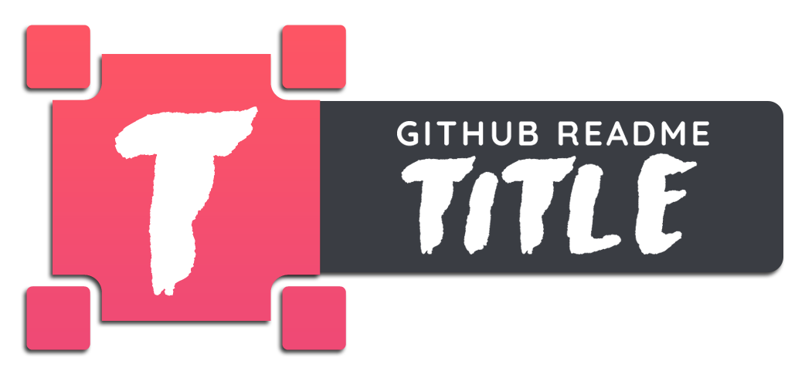

 
 <h2 align="center">GitHub Readme Title</h2>
 
Enhance Your GitHub Profile with a Sleek, Animated README Title ✨

  

    
    
    
    
     
     
    
  

## Overview
Welcome to `github-readme-title`, a creative tool designed to help you elevate your GitHub profile's README with stylish and animated titles that capture attention and express your personality or project's essence.

## Features

- **Animated Titles**: Choose from a selection of animated titles that suit your style or theme, adding a layer of sophistication and engagement to your README.
- **Customization**: Tailor the colors, fonts, and animation speed to match your personal brand or project's identity. `coming soon!`
- **Easy Integration**: Simply copy the generated markdown or HTML code and paste it into your README file for an instant transformation.
- **Free and Open Source**: Modify, distribute, and use the tool as you see fit. Contributions are welcome!

## Demo

[Visit my profile](https://github.com/su-per-man) for the usage!

***Template 1: Gradient***

## Usage/Examples
`https://github-readme-title.vercel.app/api/headings/gradient?title=Your%20Text&size=50`

## Heading Options

Endpoint: `api/headings/[template name]`

This section describes the available templates for headings and their respective parameters.

***Template 1: Gradient***

`api/headings/gradient`

| Parameter   | Type      | Default Value | Description                                      |
|-------------|-----------|---------------|--------------------------------------------------|
| title       | mandatory | N/A           | The title to be displayed.                       |
| size        | optional  | 100           | The font size, specified as a number.            |

## Show Your Support

If you find the project useful, please consider giving it a star 🌟. Your support motivates us to continue developing and improving our tools. Simply click on the star button at the top of the repository page. Thank you for your support!

## Keep your fork up to date

You can keep your fork, and thus your private Vercel instance up to date with the upstream using GitHub's [Sync Fork button](https://docs.github.com/en/pull-requests/collaborating-with-pull-requests/working-with-forks/syncing-a-fork).

## ❤️ Made with Love

This project is crafted with 💖 and a strong commitment to providing valuable tools to the community. I believe in the power of collaboration 🤝 and welcome contributions from developers of all levels. Whether you're looking to fix bugs 🐛, add new features 💡, or improve documentation 📝, your help is greatly appreciated!

## 🙋 How to Contribute

Interested in contributing? That's awesome! 🎉 Here are a few ways you can help:

- Report bugs or issues you find 🔍
- Suggest new features or enhancements 🚀
- Improve existing code or documentation ✏️

✨ Together, we can make this project even better! 🌍